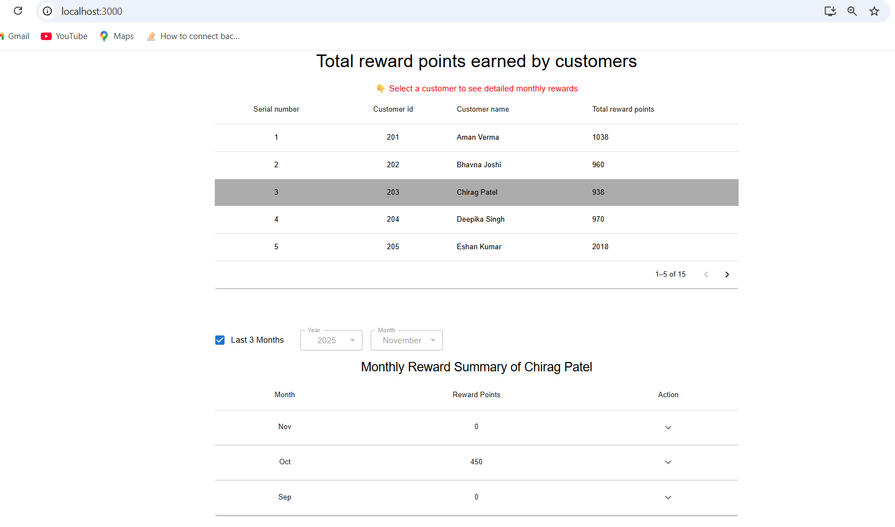

# Getting Started with Create React App

This project was bootstrapped with [Create React App](https://github.com/facebook/create-react-app).

# Reward Points Calculation App

A React application that calculates and displays monthly reward points earned by customers based on their transactions. The app includes filtering, expandable transaction tables, and a clean UI built with Material UI.

---

## Important Notes

* To view reward points earned by each customer on monthly basis, please select a customer from the main table.
* Expand rows in Monthly reward summary table to view individual transaction details(Transaction in each month)
* Total reward points of each customer is shown in the main table only.
* Filter by month / last 3 months / year
* To apply filter on month/year, please uncheck the "Last 3 Months" checkbox.

---


## 📦 Installation & Setup

### 1️ Clone the project

git clone https://github.com/riya63095/Reward-Calculating-System
cd reward-points

### 2️ Install dependencies

npm install

### 3️ Install Material UI and jest

npm install @mui/material @mui/icons-material @emotion/react @emotion/styled

### 4 Install Pino Logger

npm install pino

### 5 To run test

npm test

### 6 Start the development server

npm start

App will run at: `http://localhost:3000`


## 📁 Project Structure

```
src/
│── components/
│   ├── CustomerTable.js
│   ├── RewardTable.js
│   ├── MonthlyTransactionTable.js
│   ├── FilterBar.js
│── test/
│   ├── rewardPoints.test.js
│── utils/
│   ├── helper.js
│── data/
│   ├── transactions.json
│── App.js
│── index.js
│── logger.js
```

---

## 🧮 Reward Points Rule

| Amount Spent | Points Earned                     |
| ------------ | --------------------------------- |
| > $100       | 2 points per dollar above 100     |
| > $50        | 1 point per dollar between 50–100 |
| < $50        | No points                         |

---

## Example

For purchase amount **$120**:

```
(120 - 100) * 2 = 40 points
(100 - 50) * 1 = 50 points
total = 90 points
```

Working screenshots:




